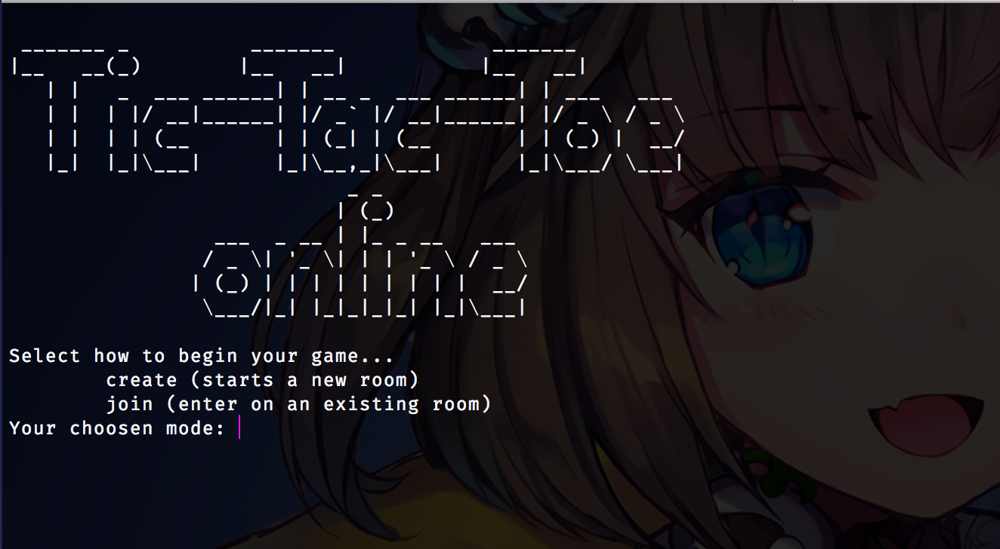

# Tic-Tac-Toe Online

Play Tic-Tac-Toe with your friends on the Terminal.

> Made on top of old [Simple-Game-Server](https://github.com/Ganapati/Simple-Game-Server)
repository which has no external dependencies whatsoever.




## Instructions for demo!

Just clone this repository and change directory for it. There's no need to download other
requirements, you only need Python 2.7 installed.

Open 3 terminal windows.

On the first one, run:
```
make server
```

And on the the second:
```
make client
```

There you can create a room for playing. Such client shall await for someone to enter
the game too.

Finally, on the third, run too:
```
make client
```

Then try to join the same room you created before.

Now the last two consoles are playing with each other. Have fun.
